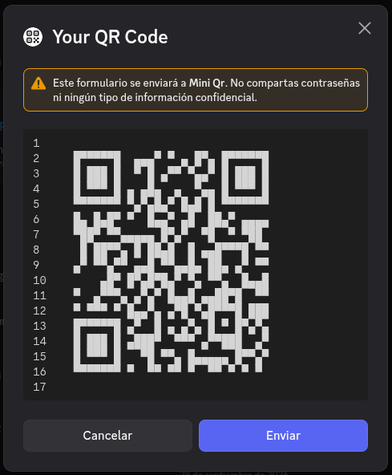

# Mini Qr
A simple **discord bot** and **api** to generate qr code in ascii

## Discord Bot
A simple command to generate a qr and show it in a modal

- **/qr** [content] (invert)

for deafult this is the qr style but if you invert it you get the classic qr code with a white background

> [!NOTE]
> The Qr has a limit of characters to not convulse and be unscaneable

## Api
why not made a api? it's simple just like the discord bot

GET: "http://localhost/api/v1/qr?content=hello!"

 

- **content**: str *
- **invert**: bool = False
- **raw**: bool = False (it return the qr in a json response)
- **long**: bool = False (it bypass the discord bot character limit)

## Invert
here are some screenshot of the invert (clasical) version of the qr code

soon :)